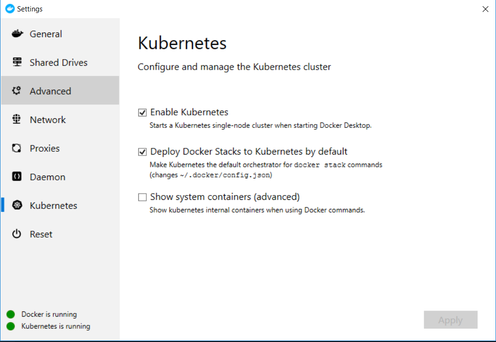

[](http://shopozor-ci.hidora.com/job/tests-pr/)

# Introduction

In the past, we made evaluations on many existing open source software that we could wrap and use as our backend. Our last attempts were with [vuestorefront](https://www.vuestorefront.io/) and [saleor](https://getsaleor.com/). The latter was the most developped of our attempts. It was almost sure that it would be our production backend.

However, `saleor` is written in python and builds up its graphql API with graphene. That has the following disadvantages:

- very slow graphql API calls
- very slow unit tests
- very slow integration / functional tests
- impossible to load a set of fixtures before all acceptance scenarios and only revert the changes made within a single acceptance scenario
- difficult to make subscriptions happen
- difficult with Django to make safe accesses to the postgres database; by default, `saleor` defines one single database user with all the necessary permissions, which is dangerous; it would be better to use the built-in postgres views to restrict the database users' permissions based on the purpose they have
- `saleor` is a big monolith where views are entangled with logic; for example, it would be a lot of work to only take the pure logic out of it; one smell of that is the way their unit tests are organized: it is a lot of work to unbraid view tests from logic tests and it is also a lot of work to unbraid their module dependencies

## Useful dev links

* [Quasar testing](https://testing.quasar.dev/)
* [GraphQL Vue Tutorial](https://learn.hasura.io/graphql/vue/introduction)
* [Vue testing handbook](https://lmiller1990.github.io/vue-testing-handbook/)
* Testing Vue.js applications in our google drive
* [Get started with storybook](https://medium.com/@mtiller/testing-react-components-using-storybook-and-cypress-1689a27f55aa)
* [Storybook for Vue](https://storybook.js.org/docs/guides/guide-vue/)
* [Storybook and Cypress](https://medium.com/@mtiller/testing-react-components-using-storybook-and-cypress-1689a27f55aa)
* [Nuxt and apollo link state](https://www.meidev.co/blog/nuxt-and-apollo-link-state/)
* [Local state management with apollo](https://vue-apollo.netlify.com/guide/local-state.html#why-use-apollo-local-state-management)

# Development setup

## General setup

### Pre-commit hooks

The first time you clone this repo, you need to configure `pre-commit` hooks:
```
apt install -y python3-pip
pip install pre-commit
git clone https://github.com/shopozor/services
cd services
git config --global init.templateDir ~/.git-template
pre-commit init-templatedir ~/.git-template
```
After that, everytime you will clone a new git repository, the `pre-commit` hooks will be enforced automatically. Would you like to enable pre-push hooks, you'd need to also run the following command in the `services` root folder:
```
pre-commit install --hook-type pre-push
```
It will essentially run all the tests before pushing. You can then disable pre-push hooks with the following command:
```
pre-commit uninstall --hook-type pre-push
```
Note that the pre-push hooks will not work on git bash under Windows. Under Windows, you will need to work with WSL to let that happen.

### VSCode configuration

Make sure you run the script
```
.vscode/install-extensions.sh
```

### Docker and docker-compose

Most of the backend stuff and the whole frontend validation are performed on docker containers:

* on Ubuntu, follow [these instructions](https://docs.docker.com/install/linux/docker-ce/ubuntu/)  
* on Windows 10, follow [these instructions](https://docs.docker.com/docker-for-windows/install/) and make sure you read [this blog](https://nickjanetakis.com/blog/setting-up-docker-for-windows-and-wsl-to-work-flawlessly) if you work with WSL

We have not experimented WSL 2 under Windows 10, but as far as WSL is concerned, we don't recommend using it if you need to work on the frontend and build it locally (not on the local k8s cluster), because `yarn` does not work well at all in WSL.

### Kubernetes

Under linux, install minikube. Under Windows, you can enable kubernetes in Docker for Desktop:



After that, you will want to

* install the [nginx ingress controller](https://kubernetes.github.io/ingress-nginx/deploy/)
```
kubectl apply -f https://raw.githubusercontent.com/kubernetes/ingress-nginx/nginx-0.29.0/deploy/static/mandatory.yaml
kubectl apply -f https://raw.githubusercontent.com/kubernetes/ingress-nginx/nginx-0.29.0/deploy/static/provider/cloud-generic.yaml
```
* [optional] [install squash](https://squash.solo.io/overview/) in order to be able to debug your k8s app
* modify your `C:\Windows\System32\drivers\etc\hosts` (or `/etc/hosts` under Linux) file by adding
```
127.0.0.1  localhost assets.shopozor api.shopozor
```
That is because our assets and api services will be served on `assets.shopozor` and `api.shopozor` hostnames locally.

#### Kubernetes dashboard

You install the kubernetes dashboard by following [these instructions](https://github.com/kubernetes/dashboard#getting-started). You can get more background [here](https://collabnix.com/kubernetes-dashboard-on-docker-desktop-for-windows-2-0-0-3-in-2-minutes/) if necessary.

Once installed, you access the k8s dashboard as follows:

1. run
```
kubectl proxy
```
2. using your favorite browser, navigate to

http://localhost:8001/api/v1/namespaces/kubernetes-dashboard/services/https:kubernetes-dashboard:/proxy/

3. on that address, you will need to provide a token; you find it in the following way (under Windows with default kubernetes installation through the docker for desktop):
```
kubectl -n kubernetes-dashboard describe secret $(kubectl -n kubernetes-dashboard get secret | grep default-token | awk '{print $1}')
```
When you have installed `devspace` (described below), you can get the token through the `devspace` UI or the command
```
devspace run kubernetes.dashboard-token
```

### Helm

First [install helm v3](https://helm.sh/docs/intro/install/), e.g. with [chocolatey](https://chocolatey.org/packages/kubernetes-helm) under Windows (you need to have admin rights):
```
choco install kubernetes-helm
```
Then, [activate the helm charts repo](https://github.com/helm/charts#how-do-i-enable-the-stable-repository-for-helm-3)
```
helm repo add stable https://kubernetes-charts.storage.googleapis.com
helm repo add bitnami https://charts.bitnami.com/bitnami
```

More information on helm:

* [create your first helm chart](https://docs.bitnami.com/kubernetes/how-to/create-your-first-helm-chart/)
* [helm quickstart guide](https://helm.sh/docs/intro/quickstart/)
* [helmfile](https://github.com/roboll/helmfile)
* [dry k8s with helm](https://blog.mimacom.com/dry-kubernetes-with-helm/)

### Devspace

You install devspace by following [these instructions](https://devspace.cloud/docs/cli/getting-started/installation). Then, the very first time you run `devspace`, tell `devspace` to use that `dev` namespace by default:
```
devspace use namespace dev
```

Later on, start developping with devspace like this:
```
devspace dev --build-sequential
```
You currently need to build the docker images sequentially, for some reason we don't know yet (maybe a bug in `devspace`).

### Hasura client

Following [these instructions](https://hasura.io/docs/1.0/graphql/manual/hasura-cli/install-hasura-cli.html#install-a-binary-globally), you need to perform the following command to install the hasura client:
```
curl -L https://github.com/hasura/graphql-engine/raw/stable/cli/get.sh | INSTALL_PATH=$HOME/bin bash
```
Under Windows, you will need to store the `hasura` bin under the name `hasura.exe`, for the sake of compatibility with `devspace`. Also, whatever OS you use, you should make sure the `hasura` binary is found in one of the paths listed in the `PATH` environment variable.

### Minio client

In order to play with the assets, you will probably need the [minio client](https://docs.min.io/docs/minio-client-quickstart-guide.html). Under Windows 10, download the [client](https://dl.min.io/client/mc/release/windows-amd64/mc.exe). Some more information here on how to use [min.io](https://min.io) in our frontend applications:

* [minio js store app](https://github.com/minio/minio-js-store-app)
* [Get permanent URL for object](https://github.com/minio/minio-js/issues/588)
* [Javascript Client API reference](https://docs.min.io/docs/javascript-client-api-reference.html)
* [minio client quickstart guide](https://docs.min.io/docs/minio-client-quickstart-guide.html)

### Node

We don't recommend using `yarn` on WSL under Windows 10 because it is not well supported there. Use it preferrably with [git bash](https://gitforwindows.org/) or devspace. To do so,

* [install nodejs](https://nodejs.org/)
* [install yarn](https://yarnpkg.com/en/docs/install#windows-stable)

Under Linux, you can run the following commands (or you can also follow [this advice](https://askubuntu.com/questions/426750/how-can-i-update-my-nodejs-to-the-latest-version)):
```bash
curl -sL https://deb.nodesource.com/setup_10.x | bash -
curl -sS https://dl.yarnpkg.com/debian/pubkey.gpg | sudo apt-key add -
echo "deb https://dl.yarnpkg.com/debian/ stable main" | sudo tee /etc/apt/sources.list.d/yarn.list
apt update
apt install -y yarn nodejs
```

# Develop locally

Development is made very easy with [devspace](http://devspace.sh):

* initialize the used namespace:
```
devspace use namespace dev
```
* start the shopozor:
```
devspace dev --build-sequential
```

Then, head to [devspace UI](http://localhost:8090) to interact with the system. Would you need to perform any action on the shopozor, like enabling the assets or the database fixtures, head to the commands in the devspace UI. Those commmands can also be run in a terminal. You list the commands like this:
```
devspace list commands
```
and you run e.g. command `assets.push` like this:
```
devspace run assets.push
```

## Adding a new graphql query / mutation / subscription

Here's how we proceed when we want to add a new query / mutation / subscription:

1. create a new graphql file with the corresponding query / mutation / subscription under `shared/graphql`
2. generate the graphql response fixture out of the database json fixtures in `backend/fixtures-generator/generate_graphql_responses.py` and `backend/fixtures-generator/graphql/responses_generator.py`; there you can also extend the `responses_generator_helpers.py`
3. write the corresponding integration test(s) in `backend/tests/test_*.py`; there you will probably need to register your query in `backend/tests/conftest.py`
4. use it in the frontend!

## Troubleshooting

### Caution notice

**Never ever** remove any `yarn.lock` file, if you don't want to lose your time fixing the build.

### Ui unit tests

Upon running the ui unit tests, you might get an error of the kind (especially on Windows machines):
```
Cannot find module '[..]/ui/node_modules/@quasar/babel-preset-app/node_modules/@babel/runtime/helpers/interopRequireDefault' from 'jest.setup.js'
```
Following [this advice](https://forum.quasar-framework.org/topic/3760/fix-babel-error-after-update-from-v1-0-0-beta22-to-v1-0-0-rc4), you can fix it this way:
```
cd node_modules/@quasar/babel-preset-app && yarn
```

## Specification generation

### Gherkin step skeletons

It is pretty handy to get the skeleton code for each step of a feature file. That can be reached with the following command for the `LogAUserIn` feature
```
cd ui/cypress/integration/Authentication
npx cucumber-js LogAUserIn.feature
```
which outputs for example
```
1) Scenario: Le membre du staff n'est pas encore enregistré # LogAUserIn.feature:13
   ? Etant donné un utilisateur non identifié
       Undefined. Implement with the following snippet:

         Given('un utilisateur non identifié', function () {
           // Write code here that turns the phrase above into concrete actions
           return 'pending';
         });

   ? Lorsqu'un utilisateur s'identifie avec un e-mail et un mot de passe invalides
       Undefined. Implement with the following snippet:

         When('un utilisateur s\'identifie avec un e-mail et un mot de passe invalides', function () {
           // Write code here that turns the phrase above into concrete actions
           return 'pending';
         });

   ? Alors il obtient un message d'erreur stipulant que ses identifiants sont incorrects
       Undefined. Implement with the following snippet:

         Then('il obtient un message d\'erreur stipulant que ses identifiants sont incorrects', function () {
           // Write code here that turns the phrase above into concrete actions
           return 'pending';
         });
```

## CI / CD

Useful documentation on how to work with helm can be found here:

* [monorepo cicd helm k8s](https://www.infracloud.io/monorepo-ci-cd-helm-kubernetes/)
* [gitlab monorepo pipelines](https://aarongorka.com/blog/gitlab-monorepo-pipelines/)

In essence, our CI/CD process amounts to (see [microsoft documentation](https://docs.microsoft.com/en-us/azure/architecture/microservices/ci-cd-kubernetes))


